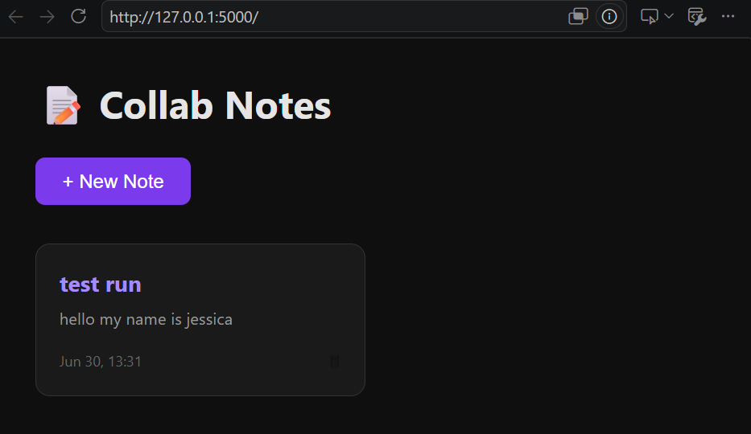
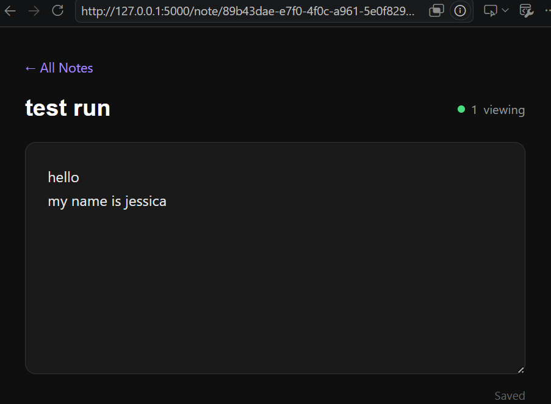

# 📝 Real-time Collaborative Notes

A real-time collaborative notes app built with Flask and Socket.IO. Multiple users can edit the same note simultaneously and see each other's changes live; similar to Google Docs.

## Features

- Create, view, and delete notes
- Real-time collaborative editing via WebSockets
- Live user count showing how many people are viewing a note
- Debounced syncing to minimize network overhead
- Auto-save on every change; no manual save button needed

## Tech Stack

- Backend: Python, Flask, Flask-SocketIO
- Database: SQLite (via SQLAlchemy ORM)
- Real-time layer: Socket.IO (WebSockets)
- Frontend: HTML, CSS, vanilla JavaScript

## Live Demo

[https://collaborative-notes-14s0.onrender.com](https://collaborative-notes-14s0.onrender.com)


## Getting Started

### Prerequisites

- Python 3.8+
- pip

### Installation

```bash
# Clone the repo
git clone https://github.com/yourusername/collab-notes.git
cd collab-notes

# Create a virtual environment
python -m venv venv
source venv/bin/activate  # Windows: venv\Scripts\activate

# Install dependencies
pip install -r requirements.txt

# Run the app
python app.py
```

Visit `http://localhost:5000`

## Project Structure

collab-notes/
├── app.py   --> Flask routes and Socket.IO event handlers

├── models.py           --> SQLAlchemy Note model

├── requirements.txt    --> Python dependencies

├── templates/

│   ├── index.html      --> Note list and creation

│   └── note.html       --> Live collaborative editor

└── static/

└── style.css        --> Styling


## How It Works

1. Each note is assigned a UUID, which becomes its shareable URL (`/note/<id>`)
2. When a user opens a note, the client joins a Socket.IO "room" scoped to that note's ID
3. As the user types, content changes are debounced (400ms) and emitted to the server
4. The server saves the change to SQLite and broadcasts it to every other client in that room
5. All connected clients update instantly without needing to refresh


## Screenshots



## Planned Features

- Typing indicators ("Jess is typing...")
- Shared cursor position visualization
- Markdown live preview
- User authentication and attribution per edit
- Deploy with WebSocket support on Render

## Author

**Jessica John** 

[GitHub](https://github.com/jessicajohn23) · [LinkedIn](https://linkedin.com/in/jessicajohn07)
